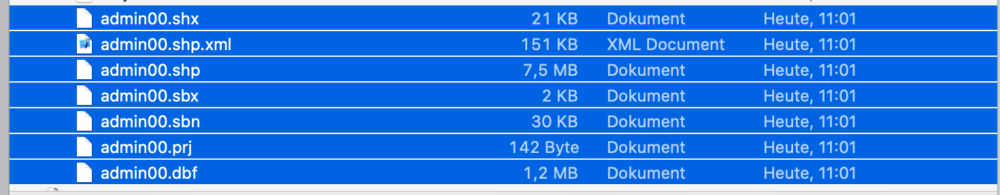

# GVI Projekt 1 - Diagramme
author: Felix Schick (71scfe1bif), Nicolas Mohr (81moni1bif)  
date: 29. November 2019

## Aufgabe 1 - Bevölkerungsdichte in Europa

Der Datensatz, welcher für diese Aufgabe benutzt werden sollte bestand aus mehreren Sätzen des Dateiformats **Shapefile**. Dieses von ESRI entwickelte Dateiformat wird als Container für vektorielle Geodaten benutzt.

Es existiert eine JavaScript Library namens [shapefile.js](https://github.com/calvinmetcalf/shapefile-js), welche Funktionalitäten zum parsen von Shapefiles bietet.

Da sich das Shapefile Format aus verschiedenen Datein zusammensetzt, war der erste Schritt das zusammenführen der Datein durch komprimieren. Die für uns relevanten Daten befinden sich im *admin00* Shapefile. Dieser Datensatz beinhaltet die meisten Länder der Welt, Bundesländer und Regionen und Informationen zu Bevölkerung und Fläche jener.



Als nächster Schritt kann die komprimierte Shapefile eingelesen werden und als GeoJson genutzt werden. Die GeoJson ist nach Regionen sortiert, dies erlaubt uns für jede Region eine Bevölkerungsdichte zu berechnen und ihr eine Farbe zuzuweisen.
Diese Daten können wir dann über unseren Tiles Layer legen.  

Als letzten Schritt werden noch eine Legende und Pop-ups für die Regionen hinzugefügt um die genaue Bevölkerungsdichte dieser abzubilden. 


### Karte selber hosten

In dem Projekt Repository befindet sich das Python Skript ```serve.py``` welches einen einfachen HTTP Server mit Port 8000 im Ordner startet. Ein alternativer Port kann im Skript eingetragen werden

Server starten mit:  
```./serve.py```

Danach kann die Karte im Browser unter [http://localhost:8000/exercise1.html](http://localhost:8000/exercise1.html) angesehen werden.

## Aufgabe 2 - Web-Karte mit Points of Interest 

Als erster Schritt wurde ein Objekt definiert, welches alle für uns relevanten Daten der Points of Interest erfasste. Diese sind der Name, die Adresse und die Kategory des Orts.  
Mit *geocode* wurde anschließend ein API-Request mit der Adresse der Orte gesendet und ein Marker, für die Kategorie des Ortes, erstellt und dem Marker ein Pop-up mit allen Relevanten Informationen zugewiesen.  

Für jede Kategorie wurde eine eigene Layer Group erstellt und alle Marker dieser Kategorie der Layer Group hinzugefügt.
Anschließend wurden alle Layer Groups der Karte hinzugefügt.


Da alle Marker einer Layer Group angehören, können diese Gruppen der *Layer Control* zugewiesen werden, welche es erlaubt einzelne Layer ein und auszublenden.


### Karte selber hosten

In dem Projekt Repository befindet sich das Python Skript ```serve.py``` welches einen einfachen HTTP Server mit Port 8000 im Ordner startet. Ein alternativer Port kann im Skript eingetragen werden

Server starten mit:  
```./serve.py```

Danach kann die Karte im Browser unter [http://localhost:8000/exercise1.html](http://localhost:8000/exercise2.html) angesehen werden.


## Aufgabe 3 - Karte Sustainable Indicators in Europa
Der Datensatz der Sustainable Indicators der UN ist im CSV-Format kann von der in der Aufgabenstellung spezifizierten Seite heruntergeladen werden.
Leider weist der Datensatze einige Eigenschaften auf, die das Parsen erschweren, wie beispielsweise eine übergroße Menge an Nullbytes am Ende der Datei.
Eine von solchen Eigenschaften bereinigte Version der CSV-Datei ist unter [content/un_data.csv](content/un_data.csv) zu finden.
Diese Datei wird, wie auch in Aufgabe 2, vom Python Webserver unter server.py gehostet.

Das Frontend ist in [exercise3.html](exercise3.html) zu finden.
Es fragt die CSV-basierten Daten vom Server an und parsed sie anschließend in Javascript-Objekte.
Anschließend werden vom Server die Daten der bereits in vorherigen Aufgaben verwendete GeoJSON-Datei eingelesen.
Da die Länderspezifischen Daten der GeoJSON und die Daten der UN mit identischen Ländercodes markiert sind, können die zu Ländern korrespondierenden Datensätze leicht zugeordnet werden und in als GeoJSON Länder- `properties` eingefügt werden.

Anschließend treten verschiedene Layer zur Visualisierung der Datenwerte in Kraft.
Aus den numerischen Werten für die einzelnen Datenkategorien und Jahren Werten wird über eine Formel ein abgestufter Farbton berechnet.
Die Farbskala muss hier bei manchen Kategorien umgekehrt werden, wenn niedrige Werte einen als besser zu interpretierenden Wert repräsentieren.
Mit einem Menü im User Interface kann zwischen den verschiedenen Datenkategorien und Jahren gewechselt werden.

Durch einen Klick auf die Länder der Karte können die konkreten Werte in einem Popup angezeigt werden lassen.

Durch die Farbskala werden problematische Wasserwerte in Südosteuropa schnell offensichtlich. 


Einige europäische Länder weisen des öfteren keine Daten auf. Diese werden in der Visualisierung als farblos markiert.


In Kategorien, in denen alle Werte außerhalb bedenklicher Bereiche liegen, wird es schwieriger, die Werte visuell gegeneinander abzuschätzen.


### Karte selber hosten

In dem Projekt Repository befindet sich das Python Skript ```serve.py``` welches einen einfachen HTTP Server mit Port 8000 im Ordner startet. Ein alternativer Port kann im Skript eingetragen werden

Server starten mit:  
```./serve.py```

Danach kann die Karte im Browser unter [http://localhost:8000/exercise1.html](http://localhost:8000/exercise1.html) angesehen werden.
